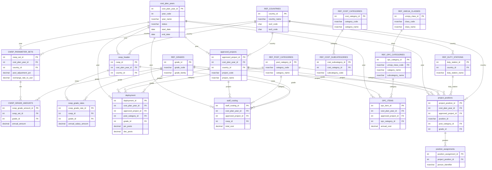

# CostPlans schema diagram

Open this file in VS Code and use **Mermaid** preview (e.g. "Markdown Preview Mermaid Support" or "Mermaid Preview" extension) to view the diagram.

```mermaid
erDiagram
  cost_plan_years ||--o{ approved_projects : "year"
  REF_COUNTRIES ||--o{ approved_projects : "country"
  cost_plan_years ||--o{ CWSP_PARAMETER_SETS : "year"
  REF_COUNTRIES ||--o{ CWSP_PARAMETER_SETS : "country"
  CWSP_PARAMETER_SETS ||--o{ CWSP_GRADE_AMOUNTS : "set"
  REF_GRADES ||--o{ CWSP_GRADE_AMOUNTS : "grade"
  cost_plan_years ||--o{ cwsp_header : "year"
  REF_COUNTRIES ||--o{ cwsp_header : "country"
  cwsp_header ||--o{ cwsp_grade_rates : "cwsp"
  REF_GRADES ||--o{ cwsp_grade_rates : "grade"
  cost_plan_years ||--o{ deployment : "year"
  approved_projects ||--o{ deployment : "project"
  REF_POST_CATEGORIES ||--o{ deployment : "category"
  REF_GRADES ||--o{ deployment : "grade"
  cost_plan_years ||--o{ staff_costing : "year"
  approved_projects ||--o{ staff_costing : "project"
  REF_POST_CATEGORIES ||--o{ staff_costing : "category"
  REF_GRADES ||--o{ staff_costing : "grade"
  cwsp_header ||--o{ staff_costing : "cwsp"
  cost_plan_years ||--o{ OPC_ITEMS : "year"
  approved_projects ||--o{ OPC_ITEMS : "project"
  REF_OPC_CATEGORIES ||--o{ OPC_ITEMS : "category"
  cost_plan_years ||--o{ project_positions : "year"
  approved_projects ||--o{ project_positions : "project"
  REF_POST_CATEGORIES ||--o{ project_positions : "category"
  REF_GRADES ||--o{ project_positions : "grade"
  REF_DUTY_STATIONS ||--o{ project_positions : "duty_station"
  REF_COUNTRIES ||--o{ project_positions : "country"
  project_positions ||--o{ position_assignments : "position"
  REF_COUNTRIES ||--o{ REF_DUTY_STATIONS : "country"
  REF_UMOJA_CLASSES ||--o{ REF_OPC_CATEGORIES : "class"
  REF_COST_CATEGORIES ||--o{ REF_COST_SUBCATEGORIES : "category"

  cost_plan_years {
    int cost_plan_year_id PK
    int year_code
    nvarchar year_name
    nvarchar status
    date start_date
    date end_date
  }

  REF_COUNTRIES {
    int country_id PK
    nvarchar country_name
    char iso2_code
    char iso3_code
  }

  approved_projects {
    int approved_project_id PK
    int cost_plan_year_id FK
    int country_id FK
    nvarchar project_code
    nvarchar project_name
  }

  REF_GRADES {
    int grade_id PK
    nvarchar grade_code
    nvarchar grade_family
  }

  REF_POST_CATEGORIES {
    int post_category_id PK
    nvarchar category_code
    nvarchar category_name
  }

  CWSP_PARAMETER_SETS {
    int cwsp_set_id PK
    int cost_plan_year_id FK
    int country_id FK
    decimal post_adjustment_pct
    decimal exchange_rate_to_usd
  }

  cwsp_header {
    int cwsp_id PK
    int cost_plan_year_id FK
    int country_id FK
  }

  deployment {
    int deployment_id PK
    int cost_plan_year_id FK
    int approved_project_id FK
    int post_category_id FK
    int grade_id FK
    decimal jan_posts
    decimal dec_posts
  }

  staff_costing {
    int staff_costing_id PK
    int cost_plan_year_id FK
    int approved_project_id FK
    int cwsp_id FK
    decimal total_cost
  }

  OPC_ITEMS {
    int opc_item_id PK
    int cost_plan_year_id FK
    int approved_project_id FK
    int opc_category_id FK
    decimal annual_cost
  }

  project_positions {
    int project_position_id PK
    int cost_plan_year_id FK
    int approved_project_id FK
    nvarchar position_id
    int post_category_id FK
    int grade_id FK
  }

  position_assignments {
    int position_assignment_id PK
    int project_position_id FK
    nvarchar person_identifier
  }

  REF_OPC_CATEGORIES {
    int opc_category_id PK
    nvarchar umoja_class_code FK
    nvarchar category_name
    nvarchar subcategory_name
  }

  REF_UMOJA_CLASSES {
    int umoja_class_id PK
    nvarchar class_code
    nvarchar class_name
  }

  REF_DUTY_STATIONS {
    int duty_station_id PK
    int country_id FK
    nvarchar duty_station_name
  }

  REF_COST_CATEGORIES {
    int cost_category_id PK
    nvarchar category_code
    nvarchar category_name
  }

  REF_COST_SUBCATEGORIES {
    int cost_subcategory_id PK
    int cost_category_id FK
    nvarchar subcategory_code
  }

  CWSP_GRADE_AMOUNTS {
    int cwsp_grade_amount_id PK
    int cwsp_set_id FK
    int grade_id FK
    decimal annual_amount
  }

  cwsp_grade_rates {
    int cwsp_grade_rate_id PK
    int cwsp_id FK
    int grade_id FK
    decimal annual_salary_amount
  }
```
